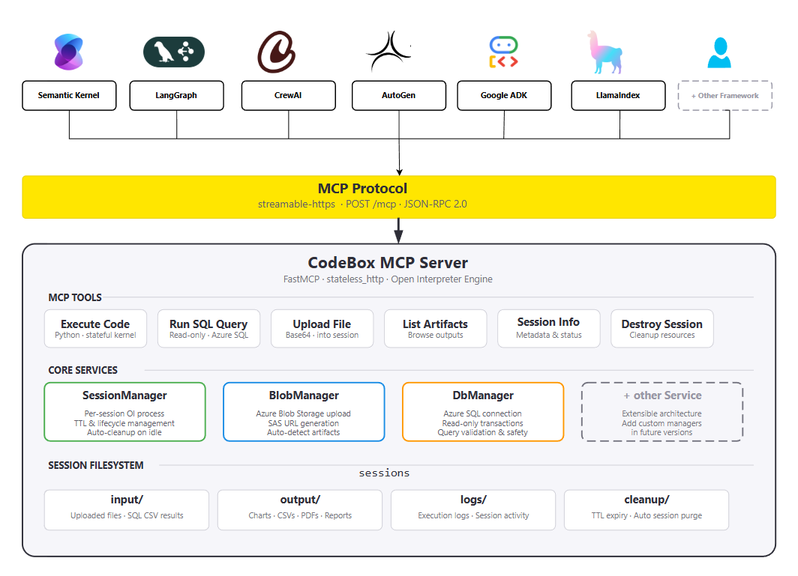

<p align="center">
  <h1 align="center">📦 Code Box</h1>
  <p align="center">
    <strong>A self-hosted, open replacement for Azure Assistants Code Interpreter</strong><br>
    Stateful code execution as an MCP server — own your runtime, skip the per-token cost.
  </p>
  <p align="center">
    
    
    
    
  </p>
</p>

---

## Overview

**Code Box** is a self-hosted, production-grade replacement for [Azure Assistants Code Interpreter](https://learn.microsoft.com/en-us/azure/ai-services/openai/how-to/code-interpreter). It delivers the same stateful code execution experience — persistent kernels, file I/O, artifact generation — without being locked into the Azure OpenAI Assistants API or paying per-token execution costs.

Built on [Open Interpreter](https://github.com/OpenInterpreter/open-interpreter) and exposed via the [Model Context Protocol (MCP)](https://modelcontextprotocol.io), Code Box runs on **any infrastructure** (your laptop, a VM, Azure Web App, a container) and plugs into **any MCP-compatible agent framework**: Semantic Kernel, LangGraph, CrewAI, AutoGen, or your own custom client.

### Why Code Box over Azure Code Interpreter?

| | Azure Code Interpreter | Code Box |
|---|---|---|
| **Hosting** | Managed by Azure OpenAI — no control | Self-hosted anywhere — full control |
| **Cost** | Per-token + per-session charges | Zero marginal cost — run on your own compute |
| **LLM coupling** | Tightly bound to Azure OpenAI models | **No LLM at the server** — bring any model, any provider |
| **Framework lock-in** | Assistants API only | Open MCP protocol — works with any agent framework |
| **SQL queries** | Not supported | Built-in `exec_sql` with two-level read-only safety |
| **Artifact storage** | Azure-managed, opaque | Transparent local filesystem + optional Azure Blob with SAS URLs |
| **Customisation** | Limited to API parameters | Full control over timeouts, file limits, session lifecycle, blob config |
| **Multi-tenant isolation** | Per-assistant | Per-session — each session gets its own interpreter process and filesystem |

### Key Capabilities

| Capability | Description |
|---|---|
| **Stateful Code Execution** | Run Python/JS code across multiple calls; variables, imports, and DataFrames persist within a session. |
| **SQL Query Execution** | Run read-only `SELECT` queries against Azure SQL with two-level safety (keyword blocking + always-rollback). |
| **File Upload & Download** | Download files from URLs into isolated session workspaces for processing. |
| **Artifact Management** | Auto-detect generated files (plots, CSVs, Excel, HTML, PDF, SVG, JSON) and surface them to the agent. |
| **Azure Blob Integration** | Auto-upload artifacts to Azure Blob Storage with time-limited SAS URLs. |
| **Multi-Tenant Isolation** | Each session gets its own interpreter process, filesystem, and lifecycle. |

---

## Architecture

<p align="center">
  
</p>

### Design Principles

- **One interpreter per session** — complete isolation; no state bleeds across sessions.
- **Zero LLM dependency** — the server executes code directly via Open Interpreter's runtime. Your agent chooses the model; Code Box just runs the code.
- **Stateless HTTP transport** — every request is independent, making it fully compatible with Azure Web App reverse proxies, load balancers, and containers.
- **Client config clamping** — `effective = min(client_value, server_max)` ensures server-configured safety limits can never be exceeded by any client.

---

## Prerequisites

| Requirement | Details |
|---|---|
| **Python** | 3.10 or higher |
| **pip** | Latest version recommended |
| **ODBC Driver** *(if using `exec_sql`)* | Microsoft ODBC Driver 17+ for SQL Server |
| **Azure Blob Storage** *(optional)* | Storage account + connection string for artifact uploads |
| **Azure SQL Database** *(optional)* | Database + connection string for `exec_sql` |

---

## Quick Start

### 1. Clone & set up the environment

```bash
cd CodeBoxMCP

# Create and activate a virtual environment
python -m venv .venv

# Windows
.venv\Scripts\activate

# Linux / macOS
source .venv/bin/activate

# Install dependencies
pip install -r requirements.txt
```

### 2. Configure environment variables

Create a `.env` file in the project root:

```dotenv
# ─── Server ───
MCP_SERVER_NAME=Code Interpreter MCP
MCP_HOST=0.0.0.0
MCP_PORT=8000

# ─── Session Lifecycle ───
SESSION_TTL=3600
IDLE_TIMEOUT=1800
EXEC_TIMEOUT=300

# ─── Azure Blob Storage (optional) ───
AZURE_BLOB_CONNECTION_STRING=<your-connection-string>
AZURE_BLOB_CONTAINER_NAME=code-interpreter-artifacts
BLOB_SAS_EXPIRY_HOURS=24

# ─── Azure SQL Database (optional) ───
AZURE_DATABASE_CONNECTION_STRING=<your-odbc-connection-string>
AZURE_DATABASE_PASSWORD=<your-password>
```

### 3. Start the server

```bash
# Option A — module
python -m codebox

# Option B — script
python server.py

# Option C — shell (Linux/macOS)
bash run.sh
```

On success the server logs:

```
============================================================
  Code Interpreter MCP
  Transport : streamable-http
  Endpoint  : http://localhost:8000/mcp
============================================================
```

---

## MCP Tools Reference

Code Box exposes **7 tools** via MCP. All accept and return JSON.

| Tool | Purpose |
|---|---|
| [`exec_code`](#exec_code) | Run Python/JS in a **stateful** kernel — variables persist across calls |
| [`exec_sql`](#exec_sql) | Run **read-only SELECT** queries against Azure SQL |
| [`upload_file`](#upload_file) | Download a file from a URL into the session's `input/` folder |
| [`list_artifacts`](#list_artifacts) | List all generated files in `output/` |
| [`session_info`](#session_info) | Get session paths (`input_dir`, `output_dir`) and effective config |
| [`list_sessions`](#list_sessions) | Show all active sessions |
| [`destroy_session`](#destroy_session) | Kill a session and free resources |

### `exec_code`

Execute code in a stateful interpreter session. State **persists** within the same `session_id` — variables, imports, DataFrames all survive across calls. Don't re-import or re-load what's already in memory; reference existing variables directly.

```
Parameters:
  session_id  (string, required)  — Unique session identifier; auto-created on first use.
  language    (string, required)  — e.g. "python"
  code        (string, required)  — The code to execute.
```

Generated files (plots, CSVs, etc.) are automatically detected as artifacts. If Azure Blob is configured, each artifact gets a **SAS URL** in the response (`new_artifacts[].sas_url`).

### `exec_sql`

Run a read-only SQL query with **two-level safety**:

1. **Application layer** — keyword blocking (rejects `INSERT`, `UPDATE`, `DELETE`, `DROP`, etc.).
2. **Database layer** — always-rollback transaction; no writes can ever persist.

**Small results** (≤ `SQL_MAX_INLINE_ROWS`, default 30) are returned inline as JSON. **Large results** are saved as CSV in `input/` — load directly with `pd.read_csv(path)`, no re-upload needed.

### `upload_file`

Download a file from a URL (public or SAS) into the session's `input/` folder. Use the returned `saved_path` in subsequent `exec_code` calls. Respects `MAX_DOWNLOAD_SIZE` (default 500 MB) and `DOWNLOAD_TIMEOUT` (default 120 s).

### `list_artifacts`

Returns metadata for every artifact in the session's `output/` directory (filename, path, extension, size, optional SAS URL).

### `session_info`

Returns the session's working directory paths (`workdir`, `input_dir`, `output_dir`) and effective configuration. **Recommended as the first call** so the agent discovers absolute paths before writing or reading files.

### `list_sessions`

Returns all active sessions with `age_seconds`, `idle_seconds`, and `workdir`.

### `destroy_session`

Explicitly destroys a session — kills the interpreter process and deletes all session files. Call this when the agent is done to release resources.

---

## Session Lifecycle

Sessions are **auto-created** on first use — just pass any `session_id` and go. No explicit "create" step required.

```
First call with session_id          Subsequent calls (same ID)
         │                                    │
         ▼                                    ▼
  ┌──────────────┐                   ┌──────────────┐
  │ Auto-Create  │                   │ Reuse Session│
  │ • New kernel │                   │ • State kept │
  │ • Filesystem │                   │ • Timer reset│
  └──────────────┘                   └──────────────┘
         │                                    │
         └──────── Expires or Destroyed ──────┘
                          │
                          ▼
                  ┌──────────────┐
                  │   Cleaned Up │
                  │ • Process killed │
                  │ • Files deleted  │
                  └──────────────┘
```

- **TTL & idle timeout** — sessions expire after `SESSION_TTL` seconds total or `IDLE_TIMEOUT` seconds of inactivity.
- **Cleanup loop** — a background thread reaps expired sessions every `CLEANUP_INTERVAL` seconds.
- **Session recovery** — if a session is not found (expired/cleaned up), create a new one with the same `session_id` and re-upload files / re-run setup. Do not assume prior state survived.

---

## Best Practices

1. **First call**: `session_info` to discover absolute paths, then import libraries + load data.
2. **Next calls**: reuse variables already in memory — don't re-import or re-load.
3. **Save outputs** to `output/` using absolute paths — they become artifacts automatically.
4. **Check `new_artifacts`** in `exec_code` responses for file paths and SAS URLs.
5. **Use `exec_sql`** for SQL queries — results land directly in the session, no extra code needed.
6. **On error**, fix only the broken line — don't re-run everything from scratch.
7. **Call `destroy_session`** when done to free interpreter processes and disk space.

---

## Client HTTP Headers

Clients can override server defaults on a per-request basis via HTTP headers. Values are **clamped** against server maximums.

| Header | Overrides |
|---|---|
| `X-Session-Ttl` | `SESSION_TTL` |
| `X-Idle-Timeout` | `IDLE_TIMEOUT` |
| `X-Exec-Timeout` | `EXEC_TIMEOUT` |
| `X-Download-Timeout` | `DOWNLOAD_TIMEOUT` |
| `X-Max-Download-Size` | `MAX_DOWNLOAD_SIZE` |
| `X-Blob-Connection-String` | Azure Blob connection string |
| `X-Blob-Container-Name` | Azure Blob container name |
| `X-Blob-Sas-Expiry-Hours` | SAS URL expiry |
| `X-Db-Connection-String` | Azure SQL connection string |
| `X-Db-Password` | Azure SQL password |

---

## Connecting from Agent Frameworks

Code Box works with **any MCP-compatible client**. Here are quick-start snippets for popular frameworks:

### Semantic Kernel (Python)

```python
from semantic_kernel.connectors.mcp import MCPStreamableHttpPlugin

plugin = MCPStreamableHttpPlugin(
    name="code_box",
    url="http://localhost:8000/mcp",
)
kernel.add_plugin(plugin)
```

### LangGraph / LangChain

```python
from langchain_mcp_adapters.client import MultiServerMCPClient

async with MultiServerMCPClient({
    "code_box": {
        "url": "http://localhost:8000/mcp",
        "transport": "streamable_http",
    }
}) as client:
    tools = client.get_tools()
```

### CrewAI

```python
from crewai import Agent
from crewai_tools import MCPServerAdapter

with MCPServerAdapter(
    server_params={"url": "http://localhost:8000/mcp", "transport": "streamable_http"}
) as tools:
    agent = Agent(role="analyst", tools=tools.tools)
```

### AutoGen

```python
from autogen_ext.tools.mcp import SseServerParams, mcp_server_tools

tools = await mcp_server_tools(SseServerParams(url="http://localhost:8000/mcp"))
agent = AssistantAgent("analyst", tools=tools)
```

---

## Project Structure

```
CodeBoxMCP/
├── server.py                  # Thin launcher (delegates to codebox.server)
├── run.sh                     # Shell launcher (Linux/macOS)
├── requirements.txt           # Python dependencies
├── .env                       # Environment configuration (create this)
├── DOCUMENTATION.md           # Full integration & usage guide
├── USAGE_GUIDE.html           # HTML usage guide
├── architecture.drawio        # Architecture diagram (draw.io)
├── codebox/
│   ├── __init__.py            # Package metadata & version
│   ├── __main__.py            # `python -m codebox` entry point
│   ├── config.py              # Centralised configuration (env vars)
│   ├── server.py              # FastMCP server, tool definitions, entrypoint
│   ├── session_manager.py     # Session lifecycle & interpreter management
│   ├── db_manager.py          # Azure SQL query execution & safety
│   ├── helpers.py             # Blob storage, artifact detection, downloads
│   └── resources.py           # Embedded usage guide resource
└── sessions/                  # Runtime session filesystems (auto-created)
```

---

## Configuration Reference

All settings are configurable via environment variables or a `.env` file.

| Variable | Default | Description |
|---|---|---|
| `MCP_SERVER_NAME` | `Code Interpreter MCP` | Server display name |
| `MCP_HOST` | `0.0.0.0` | Bind address |
| `PORT` / `MCP_PORT` | `8000` | Listening port |
| `MCP_TRANSPORT` | `streamable-http` | Transport protocol |
| `SESSION_TTL` | `3600` (1h) | Max session lifetime (seconds) |
| `IDLE_TIMEOUT` | `1800` (30m) | Max idle time before cleanup (seconds) |
| `CLEANUP_INTERVAL` | `60` | Cleanup loop interval (seconds) |
| `EXEC_TIMEOUT` | `300` (5m) | Max code execution time per call (seconds) |
| `DOWNLOAD_TIMEOUT` | `120` | Max file download time (seconds) |
| `MAX_DOWNLOAD_SIZE` | `524288000` (500 MB) | Max downloadable file size (bytes) |
| `SQL_MAX_INLINE_ROWS` | `30` | Row threshold for inline vs. CSV delivery |

See [DOCUMENTATION.md](DOCUMENTATION.md#5-configuration-reference) for the full reference including Azure Blob and SQL settings.

---

## Security

- **No LLM at the server** — code is executed directly; the server never makes model API calls.
- **SQL safety** — two-level protection: keyword blocking + always-rollback transactions.
- **Session isolation** — each session runs in its own interpreter process with an isolated filesystem.
- **Config clamping** — client-supplied values can never exceed server-configured maximums.
- **Blob SAS URLs** — time-limited, read-only access tokens for artifact downloads.

---


## License

**Proprietary — Open Source**. See source file headers for the full license notice. Authorized use only.
